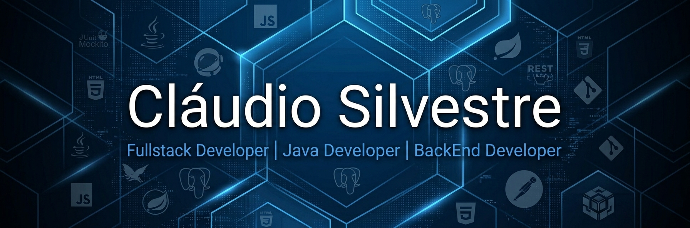

  

<h1 align="center">Hi there, I'm Cláudio 👋</h1>

<h3 align="center">
Full Stack Developer | Java Developer | Backend Developer
</h3>

## 💡 About me
I’ve been interested in how things work since I was very young, especially when it comes to technology and software.

I enjoy backend development the most, not just because of the tools I use, but because I like understanding how everything fits together behind the scenes.

When I’m coding, I usually don’t stop at “it works” — I like to understand why it works.

I don’t really follow a fixed path or focus on a specific type of project yet. I’m still exploring and learning as much as I can.

Right now, my main goal is simple: keep improving, keep learning, and become better with every project I build.

## 🚀 Tech Stack

  <!-- Backend -->
  
  
  
  
  

  <!-- Database -->
  

  <!-- Frontend -->
  
  
  
  

  <!-- Tools -->
  
  
  
  

  <!-- Testing -->
  
  

  

